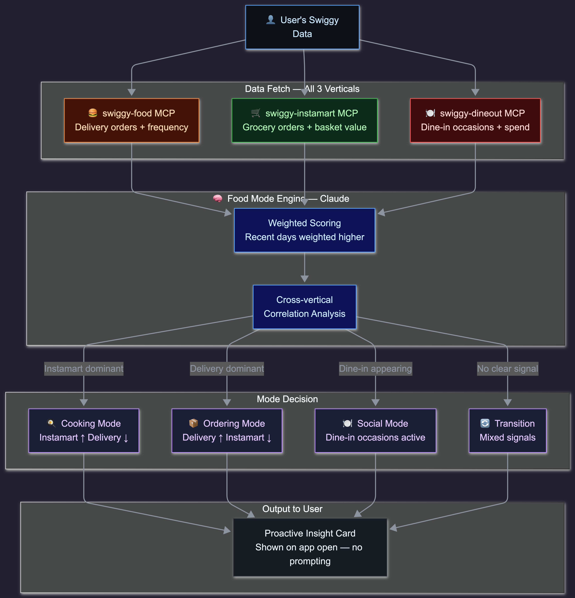

# SwiggyLens

> **See your food life clearly — powered by Swiggy MCP**

SwiggyLens is an AI agent that connects to your Swiggy account across all three verticals — food delivery, dineout, and Instamart — and tells you things about your food behavior that no single vertical ever could.

---

## The Insight

Swiggy is the only platform on earth that sees **both sides of a user's food life** — what they order from restaurants *and* what they buy from grocery stores *and* where they dine out socially.

Every other analytics tool works on one vertical. SwiggyLens is the first to reason across all three simultaneously.

---

## The Food Mode System

When you analyze grocery orders alongside restaurant delivery and dine-in history together, a pattern emerges — your **food mode**.

| Mode | Signal | What it means |
|---|---|---|
| 🍳 **Cooking Mode** | Instamart ↑, Delivery ↓ | You're cooking at home |
| 📦 **Ordering Mode** | Delivery ↑, Instamart ↓ | Busy phase, relying on delivery |
| 🍽️ **Social Mode** | Dine-in occasions appearing | Going out, social phase |

SwiggyLens detects your current food mode **automatically, every time you open the app** — without you asking anything.

---

## What It Does

### Proactive Insight Cards
No prompting needed. Open the app and see:
- Your current food mode with context
- What changed compared to last month
- How much you spent across all three verticals
- Which cuisines you've been gravitating toward

### Natural Language Chat
Ask anything about your order history:
- *"How much did I spend on food last month across everything?"*
- *"When was the last time I cooked at home consistently?"*
- *"What's my most ordered cuisine on weeknights?"*

---

## Food Mode Detection



---

## Why Only Swiggy Can Build This

| Platform | Food Delivery | Grocery | Dine-in | Cross-vertical Intelligence |
|---|---|---|---|---|
| Zomato | ✅ | ❌ | ✅ | ❌ |
| Blinkit | ❌ | ✅ | ❌ | ❌ |
| Any other app | Partial | Partial | ❌ | ❌ |
| **Swiggy** | ✅ | ✅ | ✅ | **✅ SwiggyLens** |

This is a product only Swiggy can build. SwiggyLens is the first application to actually use that moat.

---

## How It Works

```
User authenticates via Swiggy OAuth
        ↓
SwiggyLens (Next.js)
        ↓
Claude Sonnet Agent (Anthropic API)
   ├── swiggy-food MCP tools    → order history, details, patterns
   ├── swiggy-dineout MCP tools → dineout occasions, frequency
   └── swiggy-instamart MCP tools → grocery patterns, basket analysis
        ↓
Cross-vertical reasoning in a single agent loop
        ↓
Food Mode Detection + Proactive Insights + Chat
        ↓
User sees insight cards + can chat with their data
```

See [full architecture →](docs/architecture.md)

---

## Tech Stack

| Layer | Technology |
|---|---|
| Frontend | Next.js 14 + Tailwind CSS |
| AI Agent | Claude Sonnet (Anthropic API) |
| MCP Integration | Swiggy MCP Server — all 3 verticals |
| Backend | Next.js API Routes |
| Auth | Swiggy OAuth |
| Deployment | Vercel |

---

## MCP Integration

SwiggyLens calls Swiggy's MCP tools across all three verticals in a single Claude reasoning loop:

- `get_food_orders` + `get_food_order_details` — delivery history, what you ordered and when
- Dineout tools — how often you go out, where, how much you spend
- Instamart tools — grocery patterns, what you're buying, how regularly

All three tool sets go to Claude at once. It doesn't call one, wait, then call the next — it has everything in one pass and reasons across all of it together.

See [full MCP integration details →](docs/mcp-integration.md)

---

## Roadmap

### v1 — Core Intelligence
- [ ] Swiggy OAuth + cross-vertical data fetch
- [ ] Food mode detection engine
- [ ] Proactive insight cards (4 types)
- [ ] Natural language chat over order history
- [ ] Cross-vertical spend dashboard

### v2 — Behavioral Depth
- [ ] Food personality profile (shareable)
- [ ] Behavioral drift detection
- [ ] Cuisine evolution timeline
- [ ] Instamart basket intelligence

See [full roadmap →](docs/roadmap.md)

---

## Docs

- [The Food Mode Concept](docs/food-mode.md) — deep dive on the core idea
- [Architecture](docs/architecture.md) — system design and data flow
- [MCP Integration](docs/mcp-integration.md) — Swiggy MCP tools used and why
- [Roadmap](docs/roadmap.md) — v1 and beyond

---

## Built For Swiggy Builders Club

This project is submitted as part of the [Swiggy Builders Club](https://swiggy.com) MCP developer program.

**Builder:** Atharva Chirde  
**Contact:** atharva.chirde@gmail.com
