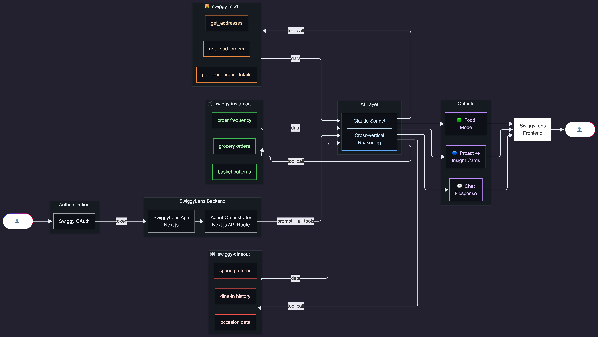
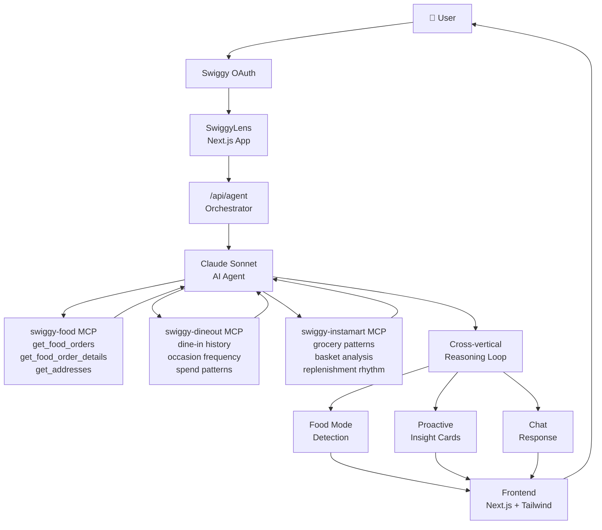

# Architecture

> How SwiggyLens connects Swiggy's three MCP verticals into a single cross-vertical intelligence layer.

---



---

## System Overview



---

## Data Flow

### On App Open (Proactive Insights)

```
1. User opens SwiggyLens
2. Frontend calls GET /api/insights
3. Agent orchestrator builds Claude context:
   - System prompt with food mode detection instructions
   - All three Swiggy MCP tool definitions attached
4. Claude calls all three MCP tool sets:
   - get_food_orders (last 90 days)
   - get_food_order_details (for pattern extraction)
   - Dineout history tools
   - Instamart order history tools
5. Claude reasons over combined dataset in one pass:
   - Detects dominant food mode
   - Identifies behavioral shifts
   - Generates 3-4 insight card texts
6. Returns structured JSON: { mode, confidence, insights[] }
7. Frontend renders InsightCard components
```

### On Chat Message

```
1. User sends message to chat interface
2. Frontend calls POST /api/agent with message + conversation history
3. Agent orchestrator maintains tool access across conversation turns
4. Claude calls specific MCP tools based on query:
   - "How much did I spend?" → get_food_orders + instamart history
   - "When did I last cook?" → instamart pattern + delivery correlation
   - "My favorite restaurant?" → get_food_order_details analysis
5. Claude responds with grounded answer (real data, not estimates)
6. Response streamed back to chat interface
```

---

## Component Architecture

```
src/
├── app/
│   ├── page.tsx                    # Dashboard — food mode + insight cards
│   ├── chat/
│   │   └── page.tsx                # Chat interface
│   └── api/
│       ├── auth/
│       │   └── callback/route.ts   # Swiggy OAuth callback handler
│       ├── agent/route.ts          # Claude agent + MCP orchestration
│       └── insights/route.ts       # Proactive insights endpoint
│
├── components/
│   ├── InsightCard.tsx             # Individual proactive insight display
│   ├── FoodModeBar.tsx             # Visual food mode indicator
│   ├── SpendChart.tsx              # Cross-vertical spending visualization
│   └── ChatInterface.tsx           # Natural language chat UI
│
└── lib/
    ├── swiggy-mcp.ts               # MCP client wrapper + tool definitions
    ├── claude-agent.ts             # Agent orchestration, tool call loop
    └── food-mode-engine.ts         # Mode detection logic + scoring
```

---

## Key Design Decisions

### Single Reasoning Loop
Claude receives all three MCP tool sets in a single context window and calls whichever tools it needs in one reasoning pass. This is more efficient and produces better cross-vertical insights than chaining separate calls.

### Server-Side Token Storage
Swiggy OAuth tokens are stored server-side (never exposed to client). All MCP calls go through Next.js API routes. The frontend never touches Swiggy credentials directly.

### Proactive by Default
The app opens to insights, not to a chat input. This is an intentional product decision — most users won't know what to ask, but everyone can read a card that says *"You've been in Ordering Mode for 10 days."*

### Streaming for Chat
Chat responses are streamed using Claude's streaming API to minimize perceived latency on longer queries that require multiple MCP tool calls.

---

## Environment Variables

```bash
# Anthropic
ANTHROPIC_API_KEY=

# Swiggy OAuth
SWIGGY_CLIENT_ID=
SWIGGY_CLIENT_SECRET=
SWIGGY_REDIRECT_URI=https://swiggy-lens.vercel.app/api/auth/callback

# Session
NEXTAUTH_SECRET=
NEXTAUTH_URL=https://swiggy-lens.vercel.app
```
